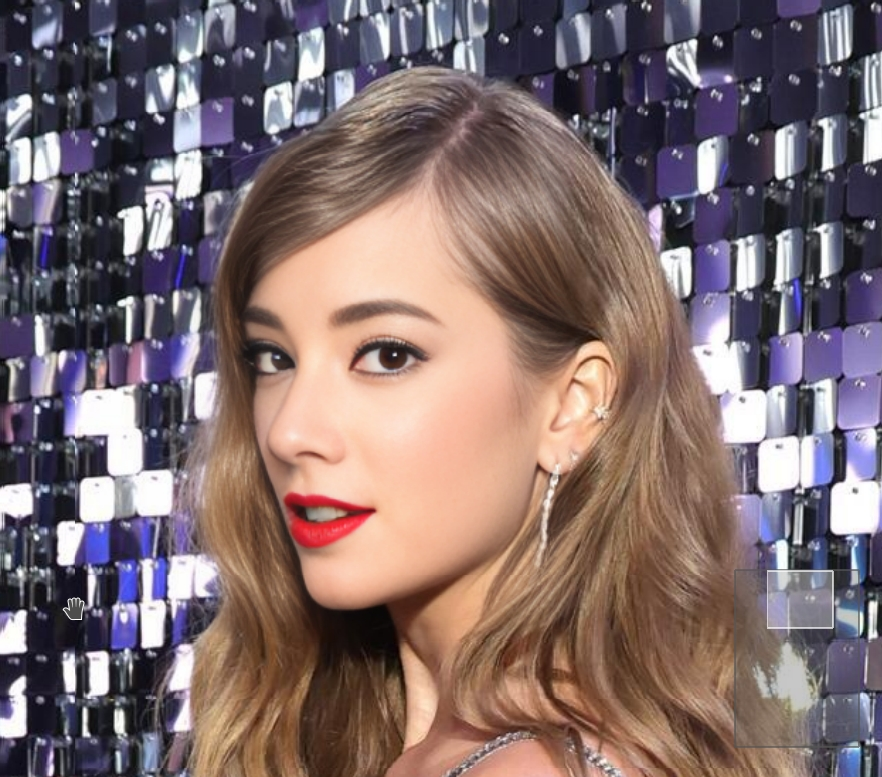
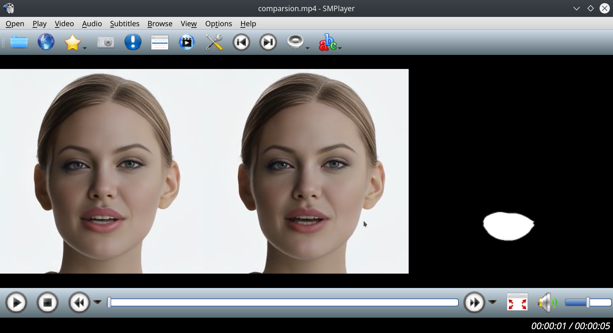

# Training character LoRA on synthetic data

This is a short research assignment with the aim to generate synthetic data and train Stable Diffusion LoRA on them.


## Face swapping

I propose to start with cloning a certain face swapper model like [https://github.com/ai-forever/ghost](https://github.com/ai-forever/ghost) (My [fork](https://github.com/hcl14/ghost)).

Clone this repo. It is quite old, so their Colab does not work, as well as requirements.txt are ill-written.

I tested it in conda environment like this, following CUDA import errors. I supposed that I need CUDA 11.x, so I choose from the configuration from [Old pytorch versions](https://pytorch.org/get-started/previous-versions/) :

```
conda create -n swap_env pytorch==1.11.0 torchvision==0.12.0 torchaudio==0.11.0 cudatoolkit=11.3 cudnn -c pytorch
```
Then, by trial and error, I propose this `requirements.txt`:

```
numpy==1.22
opencv-python
onnxruntime-gpu
mxnet-cu113
scikit-image
insightface==0.2.1
requests==2.25.1
kornia==0.5.4
dill
wandb
```

Please download weights using the authors' script. If there are problems, I've created [my local copy on Google drive](https://drive.google.com/drive/folders/1e2MXrnsdRoLMVVB0bf8Oq9e3kpS5KMQP?usp=sharing).


Use this source face image: [img/5-10.png](img/5-10.png)

Or you can use your own one or generated one. Please don't use celebrity as we are interested in training of unknown face.

If would be very interesting if you use, for example, this repo, its colab or HuggigFace space: [https://github.com/TencentARC/PhotoMaker](https://github.com/TencentARC/PhotoMaker) to generate multiple photos of a single character and then average their arcface embeddings inside the face swap model like they do:

[https://github.com/hcl14/ghost/blob/ea23cce2543a5933a22cbe98bb2973b8550a3ba1/utils/inference/core.py#L45](https://github.com/hcl14/ghost/blob/ea23cce2543a5933a22cbe98bb2973b8550a3ba1/utils/inference/core.py#L45)


I provided a couple of results for 5-10.png, but they are not perfect:

[img/5-10-1.png](img/5-10-1.png)
[img/5-10-2.png](img/5-10-2.png)
[img/5-10-3.png](img/5-10-3.png)
[img/5-10-4.png](img/5-10-4.png)


You should be able to inference swap with command like

```
python inference.py --image_to_image True --source_paths='5-10.png' --target_image='TaylorSwift28.jpeg' --out_image_name='out.png'
```


At first,

**Please use face swapping functions from this repo to write python code which creates a dataset by swapping all the faces in "Taylor Swift" folder with out target face**. You can filter the ones which look broken or unrealistic.

You will have something like this:


As you can see, the resolution of the swapped face is not big, as swaps usually operate in 224x224 or 256x256 resolution.


## Upscale face swapping results


We need face upscaler to make faces less blurry. Clone one of these:

[https://github.com/sczhou/CodeFormer](https://github.com/sczhou/CodeFormer)

[https://github.com/TencentARC/GFPGAN](https://github.com/TencentARC/GFPGAN)

[https://github.com/wzhouxiff/RestoreFormerPlusPlus](https://github.com/wzhouxiff/RestoreFormerPlusPlus)


You can already use them in bash script to restore faces on the previously generated dataset by disabling RealESRGAN background restoration.

However, I propose to dabble a bit in the code.

They all use the package called `facexlib` to make necessary image transormations and run super resolution model.

```
from facexlib.utils.face_restoration_helper import FaceRestoreHelper
```

Source code:

[https://github.com/xinntao/facexlib/blob/master/facexlib/utils/face_restoration_helper.py](https://github.com/xinntao/facexlib/blob/master/facexlib/utils/face_restoration_helper.py)

They receive 5 facial landmarks from face detector (usually RetinaFace) and align faces by warping their landmarks to template:

1.[https://github.com/xinntao/facexlib/blob/260620ae93990a300f4b16448df9bb459f1caba9/facexlib/utils/face_restoration_helper.py#L73](https://github.com/xinntao/facexlib/blob/260620ae93990a300f4b16448df9bb459f1caba9/facexlib/utils/face_restoration_helper.py#L73)
2.[https://github.com/xinntao/facexlib/blob/260620ae93990a300f4b16448df9bb459f1caba9/facexlib/utils/face_restoration_helper.py#L244](https://github.com/xinntao/facexlib/blob/260620ae93990a300f4b16448df9bb459f1caba9/facexlib/utils/face_restoration_helper.py#L244)

The faces used as input to GPFGAN, Codeformer, Restoreformer models are 512x512 and have [FFHQ dataset alignment](https://github.com/happy-jihye/FFHQ-Alignment):


They do a lot of other mathematics to align faces properly and blend them back.

Our face swap uses its own face alignment (Insightface):

[from insightface.utils import face_align](https://github.com/hcl14/ghost/blob/ea23cce2543a5933a22cbe98bb2973b8550a3ba1/insightface_func/face_detect_crop_multi.py#L9C1-L9C41)


You can take a look into original repo, it also has template and does OpenCV warping to this template:

[https://github.com/deepinsight/insightface/blob/01a34cd94f7b0f4a3f6c84ce4b988668ad7be329/python-package/insightface/utils/face_align.py#L6](https://github.com/deepinsight/insightface/blob/01a34cd94f7b0f4a3f6c84ce4b988668ad7be329/python-package/insightface/utils/face_align.py#L6)

```
arcface_dst = np.array(
    [[38.2946, 51.6963], [73.5318, 51.5014], [56.0252, 71.7366],
     [41.5493, 92.3655], [70.7299, 92.2041]],
    dtype=np.float32)

def estimate_norm(lmk, image_size=112,mode='arcface'):
    assert lmk.shape == (5, 2)
    assert image_size%112==0 or image_size%128==0
    if image_size%112==0:
        ratio = float(image_size)/112.0
        diff_x = 0
    else:
        ratio = float(image_size)/128.0
        diff_x = 8.0*ratio
    dst = arcface_dst * ratio
    dst[:,0] += diff_x
    tform = trans.SimilarityTransform()
    tform.estimate(lmk, dst)
    M = tform.params[0:2, :]
    return M

def norm_crop(img, landmark, image_size=112, mode='arcface'):
    M = estimate_norm(landmark, image_size, mode)
    warped = cv2.warpAffine(img, M, (image_size, image_size), borderValue=0.0)
    return warped
```


What I propose is to try to embed face swap into Face restoration pipeline, i.e. in case of Codeformer we can enter somewhere here

[https://github.com/sczhou/CodeFormer/blob/8392d0334956108ab53d9439c4b9fc9c4af0d66d/inference_codeformer.py#L197](https://github.com/sczhou/CodeFormer/blob/8392d0334956108ab53d9439c4b9fc9c4af0d66d/inference_codeformer.py#L197)

or we can add our fase swapping code directly into Facexlib somewhere here

[https://github.com/xinntao/facexlib/blob/260620ae93990a300f4b16448df9bb459f1caba9/facexlib/utils/face_restoration_helper.py#L259](https://github.com/xinntao/facexlib/blob/260620ae93990a300f4b16448df9bb459f1caba9/facexlib/utils/face_restoration_helper.py#L259)


We have all the face landmarks and all the warping matrices, so we can in theory, do the following:

1. Detect faces, extract faces and landmarks
2. Warp faces to swap (insightface) alignment
3. Perform face swap
4. Warp swapped faces to FFHQ alignment
5. Enhance faces using GFPGAN/Codeformer/etc
6. Warp faces back, for that we ideally need to calculate the proper warping matrix

Better to avoid multiple warpings for the same image, because it will create additional blur due to interpolation.

Face enhancement should give us some enhanced image:




## (Optional) Mouth mask to somewhat decrease mouth artifacts

Facexlib uses [face parsing model](https://github.com/zllrunning/face-parsing.PyTorch) to accurately blend face:

[https://github.com/xinntao/facexlib/blob/260620ae93990a300f4b16448df9bb459f1caba9/facexlib/utils/face_restoration_helper.py#L103](https://github.com/xinntao/facexlib/blob/260620ae93990a300f4b16448df9bb459f1caba9/facexlib/utils/face_restoration_helper.py#L103)

```
with torch.no_grad():
    out = self.face_parse(face_input)[0]
out = out.argmax(dim=1).squeeze().cpu().numpy()

mask = np.zeros(out.shape)
MASK_COLORMAP = [0, 255, 255, 255, 255, 255, 255, 255, 255, 255, 255, 255, 255, 255, 0, 255, 0, 0, 0]
for idx, color in enumerate(MASK_COLORMAP):
    mask[out == idx] = color
```

There are different choices like parsenet, BiSenet, etc. They might have their own alignment (but usually it's FFHQ).

The result of face parsing model is usually ~20 channel image which is aggregated into a single channel with integer values. For BiSenet they are:

```
[(-1, 'unlabeled'), (0, 'background'), (1, 'skin'),
(2, 'l_brow'), (3, 'r_brow'), (4, 'l_eye'), (5, 'r_eye'),
(6, 'eye_g (eye glasses)'), (7, 'l_ear'), (8, 'r_ear'), (9, 'ear_r (ear ring)'),
(10, 'nose'), (11, 'mouth'), (12, 'u_lip'), (13, 'l_lip'),
(14, 'neck'), (15, 'neck_l (necklace)'), (16, 'cloth'),
(17, 'hair'), (18, 'hat')])
```

So `MASK_COLORMAP[13]` is mouth, 14 is upper lip, etc.

As you can see from the image above, mouth is not perfect - face swap models work bad with open mouth (face restoration as well, but little bit better).

What I propose to research is to replace the mouth on swapped face with original mouth and teeth before sending the face to restoration model. For that, you can use face parsing mask, calculated on the source face before it was sent to face swap, and frames before and after swap. You migh probably want to dilate maks a bit or use blur kernel on it for smooth blending.

You can see that with mask teeth are more accurate (they were taken from original image):



**Now you can use this script to create a dataset of swapped faces.** Celebrity face brings consistent face shape and some of its consistent features into many face poses. The dataset could be of course created by wrapping swapping and face enhancing repos into scripts, but the idea was to play with face processing python code. Also, re-detection of faces with different detectors is not a good idea, as the landmarks are a bit different, so swapped and upscaled faces also become less consistent.


## Inferencing Stable Diffusion with diffusers package


You can choose your own way to train character LoRA for Stable Diffusion 1.5 models. Try to use some newer model, than vanilla SD 1.5 model.

Quck Hello World with Diffusers: [https://huggingface.co/blog/stable_diffusion](https://huggingface.co/blog/stable_diffusion).

Civitai is a good source of SD models: [https://civitai.com/models/25694/epicrealism](https://civitai.com/models/25694/epicrealism).

To download model in .safetensors format, you can right click on the download button, copy link, and then download it in terminal with "content disposition" keyword:

```
wget https://civitai.com/api/download/models/143906?type=Model&format=SafeTensor&size=pruned&fp=fp16 --content-disposition
```

To load SafeTensors to diffusers, [you can take a look into their syntax for .from_single_file()](https://huggingface.co/docs/diffusers/main/en/using-diffusers/using_safetensors)

Diffusers normally attempt to download models from HuggigFace, e.g. in their example "runwayml/stable-diffusion-v1-5" is HuggingFacepath, where they lie as folders and consume a LOT of space (vanilla SD is ~50GB). If you have problems with loading, you will likely see weird errors with Http and huggingface packages.

You can also take a look here [https://huggingface.co/docs/diffusers/using-diffusers/loading](https://huggingface.co/docs/diffusers/using-diffusers/loading)


I invite you to discover the parameters of DiffusionPipeline youself from their source code.


## Training LoRA

Here is an example how to load LoRA into existing model by diffusers: [https://huggingface.co/docs/diffusers/v0.13.0/en/training/lora](https://huggingface.co/docs/diffusers/v0.13.0/en/training/lora)

To train you lora, you can use Diffusers as well, but they do not do image captioning with BLIP, so, from my experience, it is hard for model to understand from your images what to learn. Also, the best result for diffusers training scripts comes with vanilla SD 1.5 model.


There are many LoRA training notebooks and guidelines, including the ones to learn character face.You can start from:

This notebook (may not work already due to dependency problems, you can try to run this setup locally):

[https://colab.research.google.com/github/Linaqruf/kohya-trainer/blob/main/kohya-LoRA-dreambooth.ipynb](https://colab.research.google.com/github/Linaqruf/kohya-trainer/blob/main/kohya-LoRA-dreambooth.ipynb)

EasyPhoto SD-Webui extension (again, may not work with latest versions of SD-Webui):

[https://github.com/aigc-apps/sd-webui-EasyPhoto](https://github.com/aigc-apps/sd-webui-EasyPhoto)

This guide [https://stable-diffusion-art.com/train-lora/](https://stable-diffusion-art.com/train-lora/)


