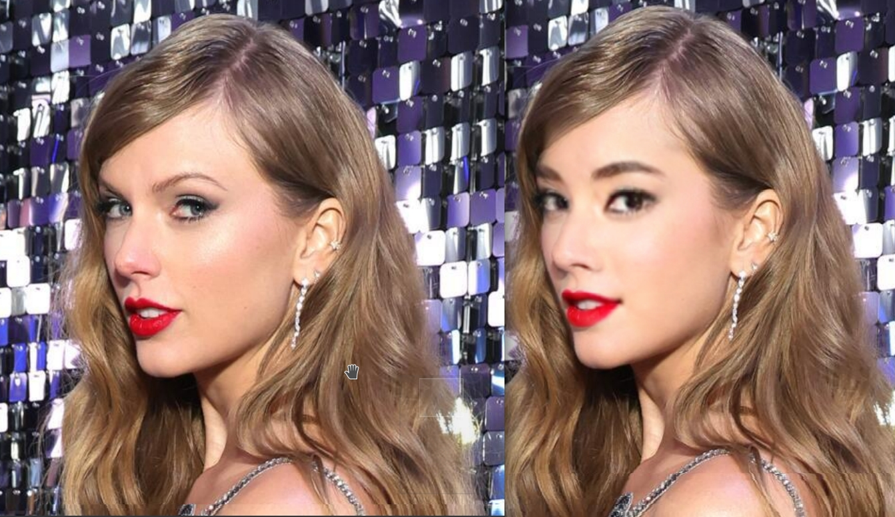
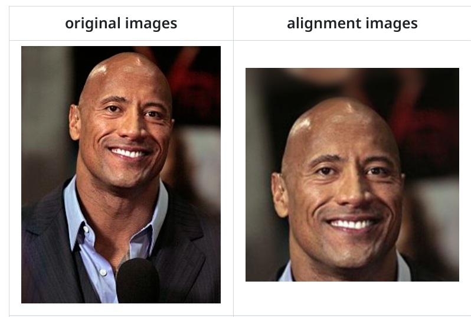

# Training character LoRA on synthetic data

This is a short research assignment with the aim to generate synthetic data and train Stable Diffusion LoRA on them.


## Face swapping

I propose to start with cloning a certain face swapper model like [https://github.com/ai-forever/ghost](https://github.com/ai-forever/ghost) (My [fork](https://github.com/hcl14/ghost)).

Clone this repo. It is quite old, so their Colab does not work, as well as requirements.txt are ill-written.

I tested it in conda environment like this, following CUDA import errors. I supposed that I need CUDA 11.x, so I choose from the configuration from [Old pytorch versions](https://pytorch.org/get-started/previous-versions/) :

```
conda create -n swap_env pytorch==1.11.0 torchvision==0.12.0 torchaudio==0.11.0 cudatoolkit=11.3 cudnn -c pytorch
```
Then, by trial and error, I propose this `requirements.txt`:

```
numpy==1.22
opencv-python
onnxruntime-gpu
mxnet-cu113
scikit-image
insightface==0.2.1
requests==2.25.1
kornia==0.5.4
dill
wandb
```

Please download weights using the authors' script. If there are problems, I've created [my local copy on Google drive](https://drive.google.com/drive/folders/1e2MXrnsdRoLMVVB0bf8Oq9e3kpS5KMQP?usp=sharing).


Use this source face image: [img/5-10.png](img/5-10.png) (Or you can use your own one or generated one. Please don't use celebrity as we are interested in training of unknown face).


You should be able to inference swap with command like

```
python inference.py --image_to_image True --source_paths='5-10.png' --target_image='TaylorSwift28.jpeg' --out_image_name='out.png'
```


At first,

**Please use face swapping functions from this repo to write python code which creates a dataset by swapping all the faces in "Taylor Swift" folder with out target face**. You can filter the ones which look broken or unrealistic.

You will have something like this:




As you can see, the resolution of the swapped face is not big, as swaps usually operate in 224x224 or 256x256 resolution.


## Upscale face swapping results


We need face upscaler. Clone one of these:

[https://github.com/sczhou/CodeFormer](https://github.com/sczhou/CodeFormer)

[https://github.com/TencentARC/GFPGAN](https://github.com/TencentARC/GFPGAN)

[https://github.com/wzhouxiff/RestoreFormerPlusPlus](https://github.com/wzhouxiff/RestoreFormerPlusPlus)


You can already use them in bash script to restore faces on the previously generated dataset by disabling RealESRGAN background restoration.

However, I propose to dabble a bit in the code.

They all use the package called `facexlib` to make necessary image transormations and run super resolution model.

```
from facexlib.utils.face_restoration_helper import FaceRestoreHelper
```

Source code:

[https://github.com/xinntao/facexlib/blob/master/facexlib/utils/face_restoration_helper.py](https://github.com/xinntao/facexlib/blob/master/facexlib/utils/face_restoration_helper.py)

They receive 5 facial landmarks from face detector (usually RetinaFace) and align faces by warping their landmarks to template:

1.[https://github.com/xinntao/facexlib/blob/260620ae93990a300f4b16448df9bb459f1caba9/facexlib/utils/face_restoration_helper.py#L73](https://github.com/xinntao/facexlib/blob/260620ae93990a300f4b16448df9bb459f1caba9/facexlib/utils/face_restoration_helper.py#L73)
2.[https://github.com/xinntao/facexlib/blob/260620ae93990a300f4b16448df9bb459f1caba9/facexlib/utils/face_restoration_helper.py#L244](https://github.com/xinntao/facexlib/blob/260620ae93990a300f4b16448df9bb459f1caba9/facexlib/utils/face_restoration_helper.py#L244)

The faces used as input to GPFGAN, Codeformer, Restoreformer models are 512x512 and have [FFHQ dataset alignment](https://github.com/happy-jihye/FFHQ-Alignment):



They do a lot of other mathematics to align faces properly and blend them back


